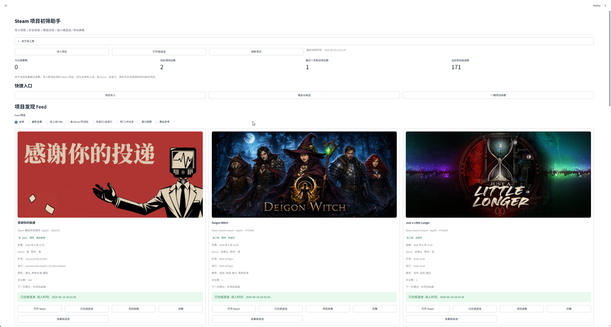
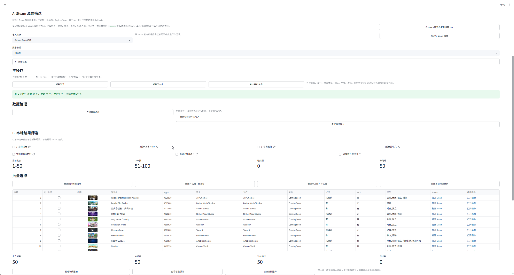
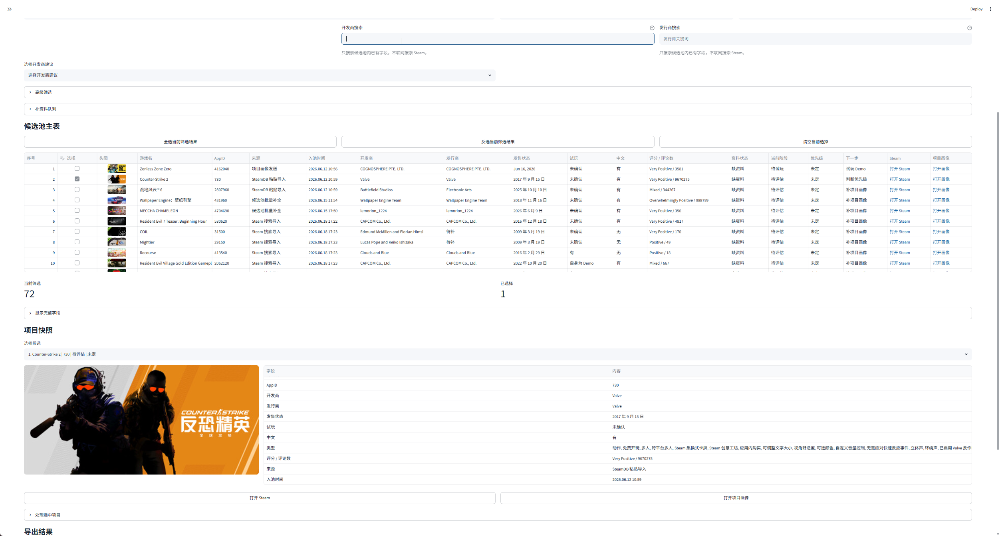
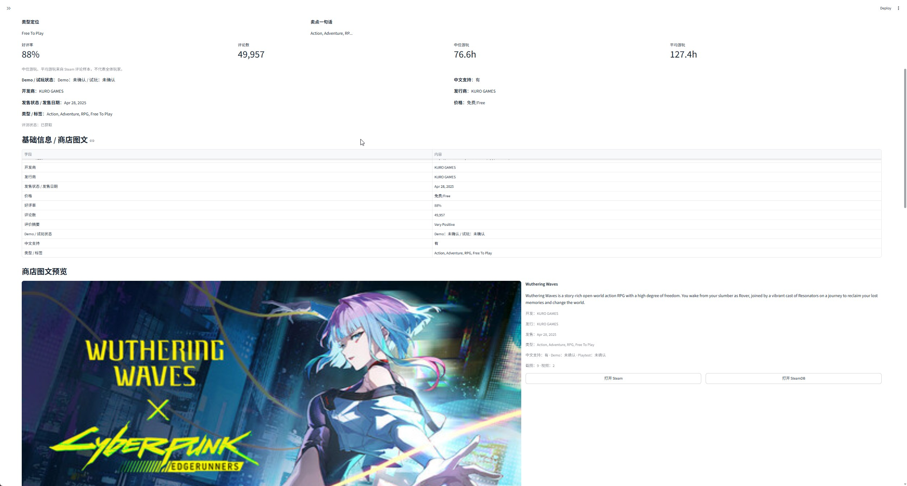

# Steam Project Assistant

Steam 独立游戏项目初筛助手｜面向独立游戏发行选品场景的本地工作台

将 Steam 项目发现、资料补全、候选池筛选、单项目画像和报告导出整理为一个可复用工作流，用于辅助发行/运营人员更快判断项目是否值得试玩、观察或联系。



## Windows Release setup

Recommended first-time setup after downloading the GitHub Release zip:

1. Unzip the release package.
2. Double-click `安装依赖.bat`.
3. Double-click `启动工具.bat`.
4. If you need Steam page collection, double-click `安装采集环境.bat`.

Notes:

- Windows may show an unknown publisher warning for `.bat` or `.vbs` files.
- Use the scripts from the official GitHub Release only.
- Playwright / Chromium setup may take 5-15 minutes depending on your network.
- If Playwright setup fails, check `logs\install_playwright.log`.
- The VBS launcher is optional and not recommended for first-time setup because it hides the console window.

## 项目定位

面向独立游戏发行选品场景的内部效率工具。当前版本是本地工作台，不是完整 SaaS。

## 解决的问题

独立游戏发行找项目时，信息分散在 Steam 搜索、SteamDB、商店页、评论、公告和人工表格中。本工具用于把这些零散信息整理成候选池，并辅助判断项目是否值得试玩、观察或联系。

## 核心工作流

项目发现 Feed → 项目导入 → 候选池管理 → 基础资料补全 → 一键项目画像 → 报告导出

## 首页 Feed 说明

首页 Feed 是本地工作台视图，不同电脑会因为本地数据不同而显示不同内容。

默认项目发现 Feed 来自：

- Steam 页面采集
- 候选池 / Steam 搜索导入 / SteamDB 粘贴导入后的候选记录
- 手动观察 / 首页快照
- Steam 图文源

“查查 / 项目画像 / 补资料”产生的 `appdetails cache` 只作为基础信息缓存，不默认进入项目发现 Feed。首页的“重新读取本地数据”只会重新读取本机 `data/` 和 `cache/` 中已有记录，不等于强制抓取最新 Steam 项目。

## 功能展示

### 项目导入



### 候选池工作台



### 一键项目画像



## 核心功能

| 模块 | 作用 |
|---|---|
| 首页项目发现 Feed | 展示最近采集项目、候选池概览和项目卡片 |
| 项目导入 | 支持 Steam 搜索结果、Steam 页面采集、SteamDB 文本 / 链接 / AppID 导入 |
| 候选池管理 | 支持状态筛选、优先级标记、下一步动作和备注 |
| 基础信息补全 | 补全开发商、发行商、发售状态、Demo、简中、类型、评论等字段 |
| 本地规则建议 | 根据资料完整度、发售状态、Demo、评论等字段给出初筛建议 |
| 一键项目画像 | 生成单项目基础信息、评论样本、公告记录和导出报告 |
| 导出 | 支持 CSV / Excel / TXT 输出 |

## 安装与采集环境

基础依赖安装后即可启动工具。Steam 页面采集需要额外安装 Playwright 和 Chromium：

```powershell
python -m pip install playwright
python -m playwright install chromium
```

也可以在项目根目录双击：

```text
安装采集环境.bat
```

首次安装 Playwright / Chromium 可能需要较长时间，通常取决于网络环境。安装脚本会把过程写入 `logs/install_playwright.log`，结束后窗口不会自动关闭。

## 技术实现

- 前端与交互：Streamlit
- 数据处理：Python / Pandas
- 页面采集：Playwright
- 数据源：Steam 商店页 / Steam appdetails / SteamDB 粘贴文本
- 本地存储：CSV / JSON cache
- 导出格式：CSV / Excel / TXT

## 当前限制

- 当前定位是本地发行工作台，不是完整 SaaS
- 部分 Steam 字段依赖页面结构和网络状态，可能需要手动校验
- SteamDB 当前只做粘贴解析，不自动爬取
- 本地规则建议不是 AI 判断，仅用于初筛辅助
- 首页 Feed 受本机数据影响，不同设备显示可能不同
- 展示截图和样例数据会进行脱敏处理

## 后续方向

- Demo 数据模式
- 在线演示版本
- 展会数据源接入
- 更稳定的打包版本

## 简历描述参考

使用 Python、Streamlit、Pandas 与 Playwright 搭建独立游戏发行选品工作台，将 Steam 项目发现、资料补全、候选池筛选、单项目画像和报告导出整理为可复用的本地工作流。

Copyright © 2026 Jennifer. All rights reserved.

This repository is published for portfolio review and technical demonstration only.
No permission is granted for commercial use, redistribution, or derivative works without explicit written consent.
